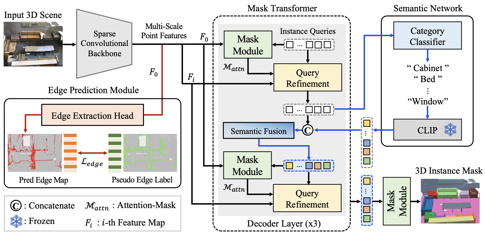

# EASE: Edge-Aware 3D Instance Segmentation Network with Intelligent Semantic Prior (CVPR 2024)

Official PyTorch implementation of the CVPR 2024 paper **EASE: Edge-Aware 3D Instance Segmentation Network with Intelligent Semantic Prior**

[\[Paper\]](https://openaccess.thecvf.com/content/CVPR2024/papers/Roh_Edge-Aware_3D_Instance_Segmentation_Network_with_Intelligent_Semantic_Prior_CVPR_2024_paper.pdf), [\[Project Page\]](https://kuai-lab.github.io/ease2024/)

Wonseok Roh, Hwanhee Jung, Giljoo Nam, Jinseop Yeom, Hyunje Park, Sang Ho Yoon, Sangpil Kim

<div align="center">
  
</div>

<br>

# Get Started

## 🛠 Environment

Install dependencies
```
# install attention_rpe_ops
cd lib/attention_rpe_ops && python3 setup.py install && cd ../../

# install pointgroup_ops
cd ease/lib && python3 setup.py develop && cd ../../

# install EASE
python3 setup.py develop

# install other dependencies
pip install -r requirements.txt

# install CLIP
pip install git+https://github.com/openai/CLIP.git
```

Note: Make sure you have installed `gcc` and `cuda`, and `nvcc` can work (if you install cuda by conda, it won't provide nvcc and you should install cuda manually.)

👾 The full version of our model is coming soon! 👾

## 📦 Datasets Preparation

### ScanNetv2
(1) Download the [ScanNetv2](http://www.scan-net.org/) dataset.

(2) Put the data in the corresponding folders. 
* Copy the files `[scene_id]_vh_clean_2.ply`,  `[scene_id]_vh_clean_2.labels.ply`,  `[scene_id]_vh_clean_2.0.010000.segs.json`  and `[scene_id].aggregation.json`  into the `dataset/scannetv2/train` and `dataset/scannetv2/val` folders according to the ScanNet v2 train/val [split](https://github.com/ScanNet/ScanNet/tree/master/Tasks/Benchmark). 

* Copy the files `[scene_id]_vh_clean_2.ply` into the `dataset/scannetv2/test` folder according to the ScanNet v2 test [split](https://github.com/ScanNet/ScanNet/tree/master/Tasks/Benchmark). 

* Put the file `scannetv2-labels.combined.tsv` in the `dataset/scannetv2` folder.

The dataset files are organized as follows.
```
PointGroup
├── dataset
│   ├── scannetv2
│   │   ├── train
│   │   │   ├── [scene_id]_vh_clean_2.ply & [scene_id]_vh_clean_2.labels.ply & [scene_id]_vh_clean_2.0.010000.segs.json & [scene_id].aggregation.json
│   │   ├── val
│   │   │   ├── [scene_id]_vh_clean_2.ply & [scene_id]_vh_clean_2.labels.ply & [scene_id]_vh_clean_2.0.010000.segs.json & [scene_id].aggregation.json
│   │   ├── test
│   │   │   ├── [scene_id]_vh_clean_2.ply 
│   │   ├── scannetv2-labels.combined.tsv
```

(3) Generate input files `[scene_id]_inst_nostuff.pth` for instance segmentation.
```
cd dataset/scannetv2
python prepare_data_inst_with_normal.py.py --data_split train
python prepare_data_inst_with_normal.py.py --data_split val
python prepare_data_inst_with_normal.py.py --data_split test
```

## 🎾 Training

### ScanNetv2
```
python3 tools/train.py configs/scannet/ease_scannet.yaml
```

## ⛳ Validation
```
python3 tools/train.py configs/scannet/ease_scannet.yaml --resume [MODEL_PATH] --eval_only
```

## 🏆 Performance

#### mAP Scores on ScanNetV2 validation Dataset
| Method           | mAP | mAP50 |
|------------------|---------|---------|
| Mask3D           | 55.2    | 73.7    |
| QueryFormer      | 56.5    | 74.2    |
| MAFT             | 59.9    | 76.5    |
| **[EASE (Ours)](https://drive.google.com/file/d/18pGy5Zb-cejCHXR_dM-6ubrB0j66zOJv/view?usp=drive_link)**      | **60.2**    | **77.2**    |

<br>

# Citation
If you find this project useful, please consider citing:

```
@inproceedings{roh2024edge,
  title={Edge-Aware 3D Instance Segmentation Network with Intelligent Semantic Prior},
  author={Roh, Wonseok and Jung, Hwanhee and Nam, Giljoo and Yeom, Jinseop and Park, Hyunje and Yoon, Sang Ho and Kim, Sangpil},
  booktitle={Proceedings of the IEEE/CVF Conference on Computer Vision and Pattern Recognition},
  pages={20644--20653},
  year={2024}
}
```
